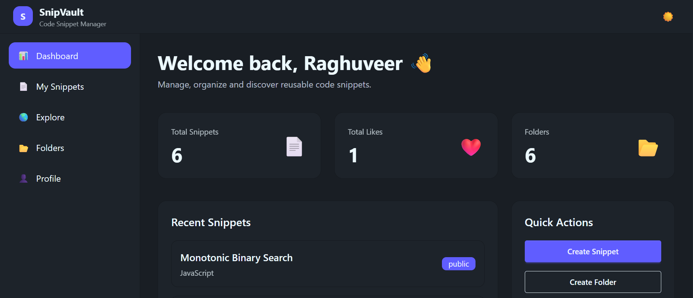
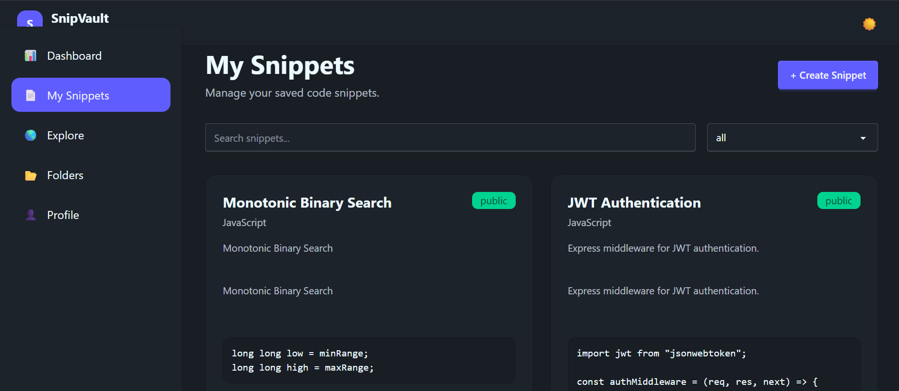
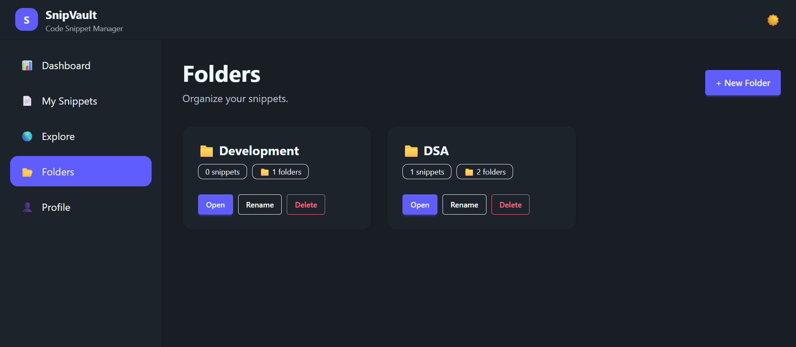
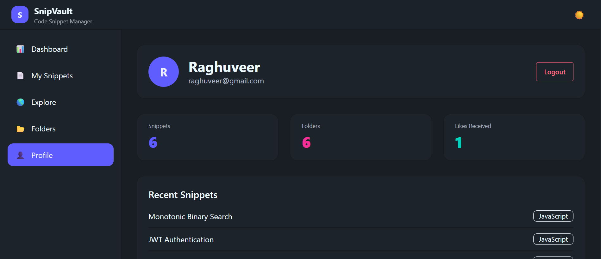

# SnipVault

A collaborative code snippet manager that allows developers to save, organize, share, and discover reusable code snippets.

## Live Demo

Frontend: YOUR_VERCEL_URL

Backend Health Check: YOUR_RENDER_URL

---

## Tech Stack

### Frontend

* React 19
* Redux Toolkit
* RTK Query
* React Router DOM
* Tailwind CSS v4
* DaisyUI
* PrismJS
* Sonner

### Backend

* Node.js
* Express.js
* MongoDB Atlas
* Mongoose
* JWT Authentication
* BcryptJS
* Zod Validation

---

## Features

### Authentication

* User Registration
* User Login
* User Logout
* Protected Routes

### Snippets

* Create Snippets
* Update Snippets
* Delete Snippets
* Public / Private Visibility
* Syntax Highlighting
* Copy Code

### Folder Management

* Create Folder
* Rename Folder
* Delete Folder
* Nested Folders
* Move Snippets Between Folders

### Community Features

* Explore Public Snippets
* Search Snippets
* Filter By Language
* Pagination
* Like / Unlike Snippets
* Comments System

### User Dashboard

* Statistics Overview
* Recent Snippets
* Profile Management

### UI

* Fully Responsive
* Mobile Drawer Navigation
* Dark / Light Theme
* Toast Notifications

---

## Screenshots

Add screenshots here:

### Dashboard



### Snippet



### Folder



### Profile Page



---

## Local Setup

### Clone Repository

```bash
git clone <repo-url>
cd snipvault
```

### Backend

```bash
cd server
npm install
npm run dev
```

### Frontend

```bash
cd client
npm install
npm run dev
```

---

## Environment Variables

### Backend

```env
PORT=
MONGO_URI=
JWT_SECRET=
CLIENT_URL=
```

### Frontend

```env
VITE_API_URL=
```

---

## Database Schema

### User

```js
name
email
password
avatar
```

### Snippet

```js
title
code
language
description
tags
visibility
createdBy
folder
likes
```

### Folder

```js
name
createdBy
parentFolder
```

### Comment

```js
text
snippetId
createdBy
```

---

## Challenges & Solutions

### Nested Folder Structure

Implemented recursive folder relationships using parentFolder references and dynamic folder navigation.

### Authentication

Implemented secure JWT authentication using HTTP-only cookies and protected routes.

### State Management

Used RTK Query for caching, invalidation, and API management across the application.

---

## Future Improvements

* Real-time collaboration
* Team workspaces
* Snippet version history
* AI-powered code suggestions
* Advanced search filters
* Folder drag-and-drop

---

Built by Raghuveer Chauhan
